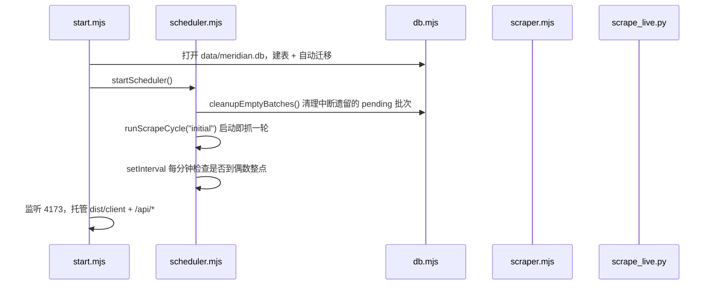
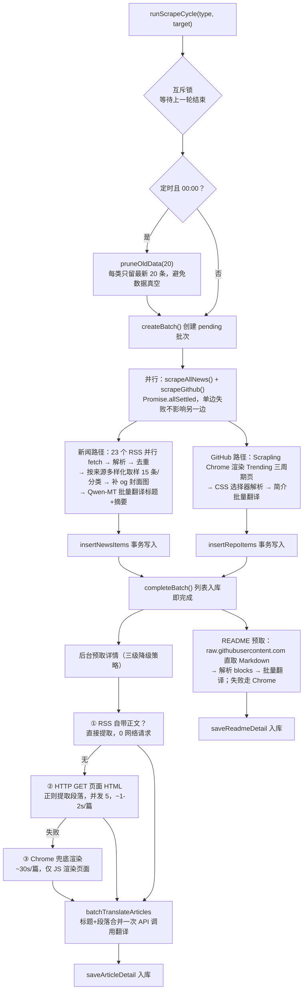
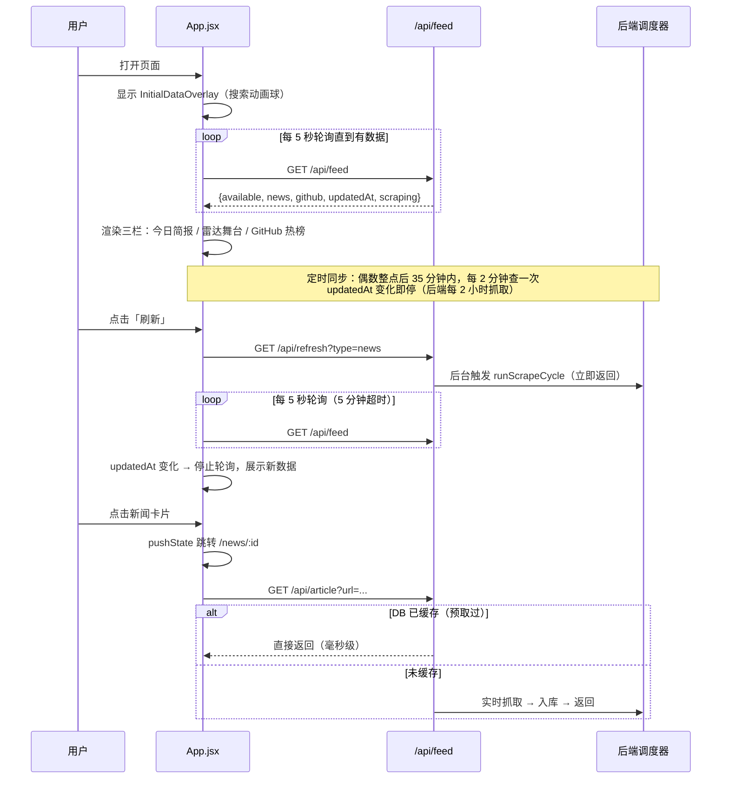
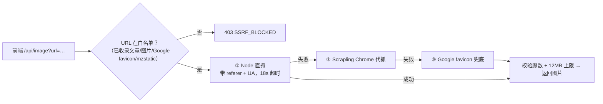

# Meridian Live Edition — 项目架构与运转流程报告

> 版本：dev 分支 · 生成日期：2026-08-01
> 定位：React 驱动的全球新闻 + GitHub 热榜实时阅读器，全中文呈现，数据全部来自实时抓取。

---

## 一、项目一句话

**每 2 小时自动抓取 6 大分类国际新闻 RSS 和 GitHub Trending 三周期热榜，经 Qwen-MT 大模型中文化后存入本地 SQLite，前端从 API 读取展示；支持手动刷新和文章/README 详情页阅读。**

---

## 二、整体架构逻辑图

```mermaid
flowchart TB
    subgraph EXT["外部数据源"]
        RSS["23 个 RSS/Atom 源<br/>TechCrunch · The Verge · MIT TR · 36Kr …"]
        GH["GitHub Trending 页面<br/>daily / weekly / monthly"]
        RAW["raw.githubusercontent.com<br/>README 原文"]
        IMG["图片源站 / Google favicon"]
    end

    subgraph BE["后端 Node.js（原生 http，无框架）· server/"]
        START["start.mjs<br/>生产入口：静态托管 + API + 启动调度器"]
        DEV["dev.mjs<br/>开发入口：仅 API（Vite 代理 /api/* 到 4173）"]
        API["feedApi.mjs<br/>HTTP 中间件：/api/feed /refresh /article /repo /image /status"]
        SCHED["scheduler.mjs<br/>调度器：启动即抓 + 每 2 小时偶数整点 + 00:00 保留式清理"]
        SCRAPE["scraper.mjs<br/>抓取引擎：RSS 解析 · SSRF 防护 · 翻译调度 · Scrapling 子进程管理"]
        SOURCES["sources.mjs<br/>数据源配置：6 分类 × 23 源"]
        DB["db.mjs<br/>SQLite 层（better-sqlite3, WAL）"]
    end

    subgraph PY["Python 抓取子进程 · scripts/scrape_live.py"]
        SCRAPLING["Scrapling 无头 Chrome<br/>github / article / readme / image 模式"]
        TRANS["翻译管道<br/>Qwen-MT（主）→ Google Translate（降级）"]
    end

    subgraph STORE[("SQLite · data/meridian.db")]
        T1["batches 批次表"]
        T2["news_items 新闻表"]
        T3["repo_items 仓库表"]
        T4["article_details 文章详情缓存"]
        T5["readme_details README 缓存"]
    end

    subgraph FE["前端 React 19 + Vite · src/"]
        APP["App.jsx<br/>单页应用：列表 / 详情 / 轮询 / 离线 404"]
        UI["视觉组件群<br/>GSAP · Spline 机器人 · GooeyNav · SpecularButton …"]
    end

    RSS -->|HTTP fetch| SCRAPE
    GH -->|Chrome 渲染| SCRAPLING
    RAW -->|HTTP fetch| SCRAPE
    IMG -->|直抓/代抓| API

    START --> API & SCHED
    DEV --> API & SCHED
    API --> DB
    API -->|未命中缓存实时抓| SCRAPE
    SCHED --> SCRAPE
    SCRAPE -->|stdin/stdout JSON<br/>串行队列| PY
    SCRAPE --> DB

    SCRAPLING --- TRANS

    DB --- STORE
    APP -->|fetch /api/*| API
    APP --> UI
```

**分层职责一句话版：**

| 层 | 文件 | 职责 | 关键约束 |
|---|---|---|---|
| 前端 | `src/App.jsx` | 单页应用：三栏布局（新闻/雷达/GitHub）、详情页、轮询、离线路由 | 无路由库，自实现 `useRoute`（pushState） |
| API 层 | `server/feedApi.mjs` | 6 个 HTTP 接口，只读 DB + 触发抓取 | 不含抓取逻辑，错误统一走 `publicApiError` |
| 调度层 | `server/scheduler.mjs` | 定时/手动抓取编排，批次生命周期 | Promise 互斥锁，同一时刻只跑一轮 |
| 抓取层 | `server/scraper.mjs` | RSS 解析、翻译调度、SSRF 防护、子进程管理 | 纯抓取无状态，不写 DB |
| 数据层 | `server/db.mjs` | SQLite 读写、批次管理、保留式清理、URL 白名单 | 事务批量写入，启动时自动迁移 |
| 爬虫 | `scripts/scrape_live.py` | Scrapling 无头 Chrome + 翻译管道 | 8 种子进程模式，stdin/stdout 传 JSON |

---

## 三、项目运转流程图

### 3.1 服务器启动流程



### 3.2 一轮抓取的核心流程（定时/手动/启动共用）



### 3.3 前端运转流程



### 3.4 图片代理降级链（所有封面图都走后端代理）



---

## 四、数据库设计

`data/meridian.db`（SQLite，WAL 模式，better-sqlite3 同步驱动）：

```
batches ────────────────┐
  id, time_label,        │ 1:N (ON DELETE CASCADE)
  batch_hour, date,      │
  scrape_type,           ├──→ news_items
  status(pending/complete)      id, batch_id, category, title, summary,
  created_at                   source, url, image, published_at, lens, created_at
                               索引: (category, created_at DESC)
                         ├──→ repo_items
                                id, batch_id, name, url, description, language,
                                total_stars, period_growth, rank, period,
                                growth_daily/weekly/monthly, created_at
article_details ── 独立缓存表（url 主键）：title, paragraphs(JSON), image, translation_provider
readme_details  ── 独立缓存表（url 主键）：title, blocks(JSON), translation_provider
```

**关键设计：**
- **批次（batch）是数据组织单位**：每次抓创建一个 pending 批次，列表入库即标 complete，详情后台预取。启动时清理中断遗留的 pending 批次。
- **排序语义**：`created_at`（入库时间）决定新批次优先，`published_at`（统一归一化为 ISO 格式）决定批内顺序——解决了 RSS 的 RFC 822 日期字典序不可排序的问题。
- **00:00 不清空而是"保留式清理"**：每类留最新 20 条再抓新数据，避免清空后出现页面数据真空；孤儿详情（不被任何条目引用的 article/readme）一并删除。
- **`getCollectedUrls()` 白名单**：DB 中已收录的 URL 集合同时充当 SSRF 防护白名单——/api/article 和 /api/image 只接受"自己抓回来过的"地址。

---

## 五、关键技术决策（给别人讲解时的要点）

### 5.1 为什么后端是"原生 Node http + SQLite"而不是框架？
单进程个人项目，接口只有 6 个。原生 `node:http` + 中间件函数足够，零框架依赖；SQLite 免运维，WAL 模式支持读写并发，`better-sqlite3` 同步 API 省去 async 噪音。

### 5.2 为什么抓取要分 JS 和 Python 两个语言？
- **JS 能干的绝不启动 Chrome**：RSS 解析（fast-xml-parser）、HTML 段落提取（正则）、raw.githubusercontent.com 直取——这些是毫秒~秒级。
- **只有必须渲染 JS 的页面**（GitHub Trending、SPA 文章页、受热链保护的图片）才走 Scrapling 无头 Chrome（Python 生态里反检测做得最好的库之一）。
- 两者通过 **stdin/stdout JSON 子进程协议**通信，Node 侧用 Promise 串行队列保证同一时刻只有一个 Chrome 进程（内存控制），150s 超时 + 12MB 输出上限防失控。

### 5.3 三级降级策略贯穿整个项目（核心设计哲学）
| 场景 | ① 最快 | ② 中等 | ③ 兜底 |
|---|---|---|---|
| 文章详情 | RSS 自带正文直接提取 | HTTP GET 页面解析 | Chrome 渲染 |
| README | raw.githubusercontent.com 直取 | — | Chrome 渲染 |
| 图片 | Node 直抓 | Scrapling 代抓 | Google favicon |
| 翻译 | Qwen-MT 专用翻译模型 | Google Translate 免费通道 | 保留原文 |
| 单条失败 | 保留原文，不影响同批其他条目 | | |

**原则：快路径处理 90% 的情况，慢路径只为剩下 10% 付出成本；任何一环失败都不让页面空白。**

### 5.4 翻译成本优化
- 列表：标题+摘要逐条翻译（并发 6）。
- 文章详情：标题+所有段落用 `|||` 分隔符**合并成一条文本**，一次 API 调用译完再拆分——N 段文章从 N+1 次调用降到 1 次。
- 先用 `needs_translation()` 判断拉丁字母/汉字比例，已经是中文的条目跳过不译。

### 5.5 安全（SSRF 防护）
后端要代抓外部 URL，必须防内网探测：`safeRemoteUrl()` 校验协议 → 黑名单 localhost/私有域名 → DNS 解析后用 `net.BlockList` 核对全部 IP（含 IPv6 映射地址）→ 重定向逐跳重新校验（`fetchWithRedirectGuard`）→ DB 白名单二次确认。图片还要校验魔数防伪造 content-type。

### 5.6 前后端"新数据感知"协议
不用 WebSocket：`/api/feed` 返回 `updatedAt`（所有条目最大入库时间），前端记录 baseline 后轮询比对，变化即停。手动刷新、定时抓取、初始加载三个场景复用同一套比对逻辑。

---

## 六、运行方式速查

```bash
# 开发（前后端分离，Vite 5173 代理 /api 到 4173）
npm run dev:all          # = npm run server（API+调度）+ npm run dev（Vite）

# 生产（单进程托管一切）
npm run build            # 构建到 dist/client
npm start                # node server/start.mjs → http://localhost:4173

# 环境配置
cp .env.example .env     # 填 TRANSLATION_API_KEY（阿里云百炼 Qwen-MT）

# 测试
npm run test:feed        # feed API 测试
python -m pytest tests/test_translation_fallback.py  # 翻译降级测试
```

**API 一览：**

| 接口 | 说明 |
|---|---|
| `GET /api/feed` | 全量数据：6 分类新闻 + 3 周期 GitHub 热榜 + updatedAt |
| `GET /api/refresh?type=all\|news\|github` | 后台触发抓取，立即返回 |
| `GET /api/status` | {hasData, scraping} 轻量状态 |
| `GET /api/article?url=` | 文章详情（DB 优先，未命中实时抓） |
| `GET /api/repo?url=` | README 详情（同上） |
| `GET /api/image?url=&referer=` | 图片代理（三级降级，2h 缓存头） |

---

## 七、搭建路径复盘（一步一步是怎么搭起来的）

1. **静态原型**：React + Vite 搭出三栏控制台风 UI（GSAP 动画、Spline 机器人、React Bits 风格组件），数据先用占位。
2. **能跑的最小数据环**：Node 原生 http 起 API，RSS fetch + fast-xml-parser 解析，直接返回给前端——此时无 DB、无翻译。
3. **接入 Chrome 抓取**：GitHub Trending 是 JS 渲染页面，引入 Python Scrapling 子进程，定下 stdin/stdout JSON + 串行队列的进程协议。
4. **中文化**：先 Google Translate 免费通道，后接入阿里云 Qwen-MT 专用翻译模型，建立"主译+降级+原文保底"三级管道和批量合并翻译优化。
5. **持久化**：引入 better-sqlite3，设计批次模型（batches → news_items/repo_items）+ 详情缓存表；写入走事务；启动自动迁移补列。
6. **调度**：从"启动抓一次"演进为"启动即抓 + 每 2 小时偶数整点 + 手动刷新"三触发源，加互斥锁防并发，加 00:00 保留式清理。
7. **详情体验**：列表入库后后台预取详情（RSS→HTTP→Chrome 三级），点击详情毫秒级打开；未命中也有实时抓取兜底。
8. **安全加固**：URL 白名单、DNS 级 SSRF 防护、重定向逐跳校验、图片魔数校验、请求体大小上限。
9. **前端打磨**：轮询协议（updatedAt 比对）、首次加载全屏动画、断网 404 页、详情页路由（自实现 pushState 路由）。
10. **部署**：生产单进程（静态+API+调度），配 Dockerfile + 自有服务器 + Caddy/Nginx 反代 HTTPS 的发布路径。

---

## 八、已知边界与未来方向

- **单实例**：SQLite + 内存互斥锁适合个人/低流量；多实例部署需要外置缓存（Redis）和集中调度。
- **Scrapling 依赖真实 Chrome**：不适合 Serverless，必须部署在有 Chrome 环境的主机/容器。
- **翻译配额**：Qwen-MT 按量计费，00:00 清理+2 小时批次已把调用量控制在每天 12 轮 × ~200 条文本的量级。
- **候选方向**：RSS 源健康度监控、失败源自动摘除、详情摘要 AI 生成、多语言切换。
