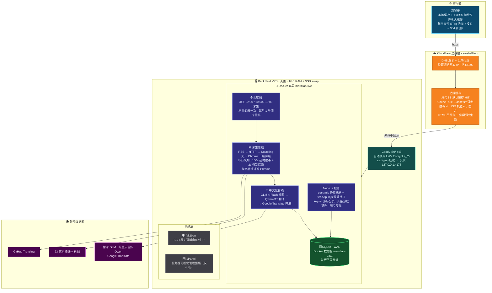
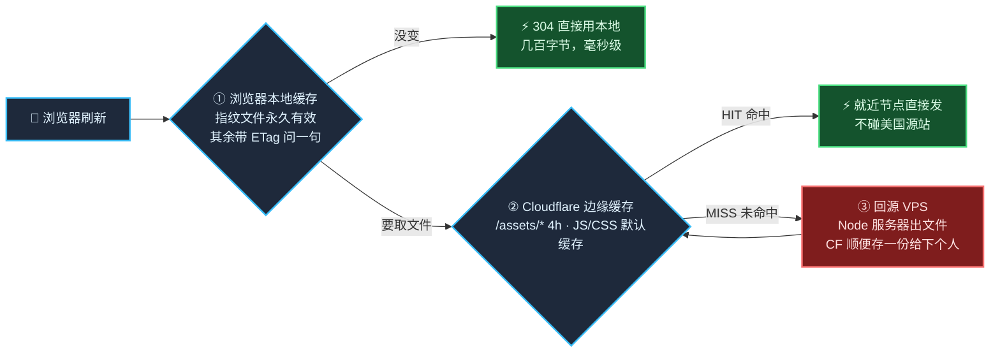
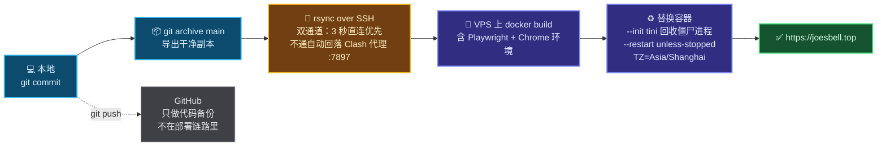

# Meridian · 线上部署架构总览

> 站点：https://joesbell.top · 本文讲"网站是怎么跑起来、怎么被访问到的"；代码内部结构见 [ARCHITECTURE.md](ARCHITECTURE.md)。

---

## 一、访问链路全景图

---

## 二、三级缓存：一次刷新到底发生了什么

**分工**：Cloudflare 缓存管"第一次访问/别的访客"的跨国速度；ETag 管"你自己反复刷新"的秒开 + 发版后内容一变指纹就变、绝不错用旧文件。两层互补，缺一不可。

---

## 三、部署链路

---

## 四、组件速查表

| 组件 | 角色 | 关键配置 |
|---|---|---|
| **Cloudflare** | DNS + 代理 + 边缘缓存 | Cache Rule：`joesbell.top/assets/*` 缓存 4h |
| **Caddy** | HTTPS 入口 + 反代 | 自动证书；`reverse_proxy 127.0.0.1:4173` |
| **Docker 容器** | 应用唯一运行环境 | `--init` · `TZ=Asia/Shanghai` · 数据卷 `meridian-data` |
| **Node 服务** | 静态托管 + API | 哈希文件 immutable 1 年；public 文件 ETag 协商缓存 |
| **调度器** | 定时采集 | 02:00 / 10:00 / 18:00 北京时间，每月 1 号清库 |
| **Scrapling + Chrome** | 硬骨头页面渲染抓取 | 串行队列，超时强杀 + 强制结算，逃逸进程按名补杀 |
| **GLM-4-Flash / Qwen-MT** | 中文化 | 摘要 60s 超时，失败逐级降级，兜底 Google Translate |
| **SQLite** | 数据持久化 | WAL 模式，Docker 卷内，发版不丢 |
| **fail2ban** | SSH 防暴力破解 | sshd jail，试错自动封 IP |
| **1Panel** | 服务器管理面板 | 仅监听 127.0.0.1:18080 |
| **SSH 双通道** | 部署网络保障 | `~/.ssh/config`：直连优先，回落 Clash 代理 |
